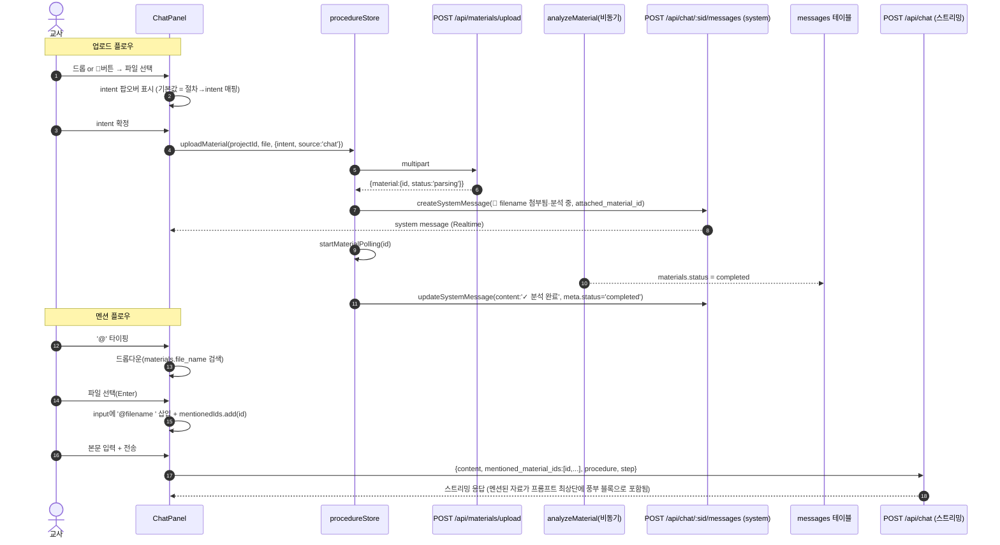

# 채팅 인라인 업로드 + @파일명 멘션 (Phase 1)

> **대상**: `curriculum-weaver` 채팅-자료 통합 레이어
> **작성일**: 2026-04-18
> **상태**: 설계 제안 (Draft v1)
> **선행**: `file-upload-redesign.md`, `material-context-enhancement.md`
> **원칙**: **단일 데이터 소스**(materials 테이블 재사용), 단일 AI 분석 파이프라인, 채팅은 이벤트 레이어일 뿐

---

## 0. 핵심 요약

| 항목 | 결론 |
|------|------|
| 저장 테이블 | 기존 `materials` 하나. 채팅 업로드 전용 테이블 만들지 않음 |
| 업로드 API | 기존 `POST /api/materials/upload` 재사용 (source=chat 메타만 추가) |
| 분석 파이프라인 | 기존 `materialAnalyzer` 그대로. intent/폴링/재분석 로직 재사용 |
| 채팅 메시지 | `sender_type='system'` + `attached_material_id` 1행 → 상태를 UPDATE |
| 멘션 | 평문 `@filename` + 별도 `mentioned_material_ids UUID[]` |
| AI 주입 | `buildMaterialsContext`에 `mentionedIds` 옵션 → 예산 무시·최상단·풍부 블록 |
| 채팅 이력 | Claude messages 배열에는 **system 메시지를 넣지 않음**(role="최근 첨부 요약"으로 system prompt 상단에 합침) |

---

## 1. 전체 UX 플로우



---

## 2. DB 스키마: `00020_messages_mentions.sql`

```sql
-- ============================================================
-- 00020_messages_mentions.sql
-- 채팅 메시지에 자료 멘션/첨부 메타데이터 추가
-- 멱등성: ADD COLUMN IF NOT EXISTS / DO $$ 가드
-- 기존 sender_type CHECK는 00012에서 이미 'system' 허용. 재확인만.
-- ============================================================

-- 1) 컬럼 추가
ALTER TABLE messages
  ADD COLUMN IF NOT EXISTS mentioned_material_ids UUID[] NOT NULL DEFAULT '{}';

ALTER TABLE messages
  ADD COLUMN IF NOT EXISTS attached_material_id UUID
    REFERENCES materials(id) ON DELETE SET NULL;

-- 시스템 메시지 처리 상태 (parsing|completed|failed) — content 재작성 대신 메타로 관리
ALTER TABLE messages
  ADD COLUMN IF NOT EXISTS processing_status TEXT;

ALTER TABLE messages
  ADD COLUMN IF NOT EXISTS error_code TEXT;

-- 2) CHECK 제약
DO $$
BEGIN
  IF NOT EXISTS (
    SELECT 1 FROM information_schema.table_constraints
    WHERE table_name='messages' AND constraint_name='messages_processing_status_check'
  ) THEN
    ALTER TABLE messages ADD CONSTRAINT messages_processing_status_check
      CHECK (processing_status IS NULL OR processing_status IN ('parsing','completed','failed'));
  END IF;
END$$;

-- 3) 인덱스
CREATE INDEX IF NOT EXISTS idx_messages_mentioned
  ON messages USING GIN (mentioned_material_ids);

CREATE INDEX IF NOT EXISTS idx_messages_attached_material
  ON messages(attached_material_id) WHERE attached_material_id IS NOT NULL;

-- 4) 코멘트
COMMENT ON COLUMN messages.mentioned_material_ids IS
  '사용자가 본문에서 @로 언급한 materials.id 배열';
COMMENT ON COLUMN messages.attached_material_id IS
  '시스템 메시지가 알리는 첨부 자료의 id (sender_type=system 일 때만 의미)';
COMMENT ON COLUMN messages.processing_status IS
  '시스템 메시지의 자료 처리 상태 (parsing|completed|failed)';
```

**하위 호환**: 기존 메시지 자동 backfill (DEFAULT '{}', NULL). 기존 채팅 코드 경로는 옵셔널 필드만 추가되었으므로 무변경 작동.

---

## 3. 시스템 메시지 저장 규약

### 3.1 생성 (업로드 직후)
```js
// server/services/chatSystemMessage.js (신규)
export async function emitMaterialAttachedMessage({ sessionId, material, procedure, step }) {
  const intentLabel = MATERIAL_INTENT_LABELS[material.intent]?.label || '수업 참고자료'
  return insertMessage({
    session_id: sessionId,
    sender_type: 'system',
    content: `📎 ${material.file_name} 첨부됨 (의도: ${intentLabel}) · 분석 중…`,
    attached_material_id: material.id,
    processing_status: 'parsing',
    procedure_context: procedure,
    step_context: step ?? null,
  })
}
```

### 3.2 상태 갱신 (폴링 완료 시)
**단일 메시지 UPDATE** (결정 — 채팅 타임라인이 지저분해지지 않음)
```js
export async function markMaterialMessageCompleted({ messageId, material }) {
  const newContent = `📎 ${material.file_name} 첨부됨 · 분석 완료 ✓`
  await updateMessage(messageId, {
    content: newContent,
    processing_status: 'completed',
  })
}
export async function markMaterialMessageFailed({ messageId, material, errorCode }) {
  await updateMessage(messageId, {
    content: `📎 ${material.file_name} 분석 실패 — 재시도 가능`,
    processing_status: 'failed',
    error_code: errorCode,
  })
}
```
Realtime 구독(`messages`)이 이미 활성이므로 UPDATE 이벤트로 모든 접속 클라이언트에 전파됨.

### 3.3 AI 주입 여부
- Claude `messages` 배열에 role=user/assistant로 **넣지 않는다**.
- 대신 `buildSystemPrompt` 상단에 "최근 첨부 이력" 요약 섹션 추가 (최근 5건, `📎 filename (의도) · 상태`).
- 이유: 시스템 메시지가 대화 턴으로 오염되면 Claude가 system role을 흉내낼 위험 + 토큰 낭비.

---

## 4. @멘션 토큰 구조

### 4.1 입력 상태 모델
```js
// ChatPanel 내부 state
const [input, setInput] = useState('')
const [mentionedIds, setMentionedIds] = useState(() => new Set())
// 드롭다운
const [mention, setMention] = useState(null) // { query, startIdx, cursor }
```

### 4.2 파싱·렌더 규칙
- textarea는 **평문 유지** (contenteditable 회피 — IME 충돌·accessibility 문제)
- 렌더 단계에서 정규식으로 `@[^\s]+`을 찾아 `<span class="mention-chip">` 스타일링 (메시지 영역에서만 표시, 입력 중에는 스타일 없음)
- 사용자가 `@filename`을 지우면 → 남은 텍스트에서 파일명 매칭 소실 → 전송 시 `mentionedIds` 중 본문과 매칭되지 않는 id 자동 제거 (정합성 보증은 서버에서 최종 검증)

### 4.3 드롭다운 UX
- 트리거: cursor 바로 왼쪽이 `@` 이거나 `@\S*` 진행 중
- 필터: `materials.file_name.toLowerCase().includes(query)` + status=completed 우선 + 최근 10개
- 키보드: ↑/↓ 커서, Enter 선택, Esc 닫기, Tab도 선택
- 선택 시: 본문 `@` ~ 현 커서 구간을 `@${file_name} `로 치환, `mentionedIds.add(material.id)`
- 새 라이브러리 도입 **없음** — 자체 구현 (~150 LOC)

### 4.4 전송 payload
```json
{
  "content": "방금 올린 @lesson-plan.md 어떻게 보세요?",
  "mentioned_material_ids": ["uuid-1"],
  "procedure": "A-2-1",
  "current_step": 3
}
```

### 4.5 서버 정합성 검증 (선택적, 권장)
```js
// chat.js 라우트
const validMentioned = await supabase.from('materials')
  .select('id, file_name, status')
  .in('id', mentioned_material_ids || [])
  .eq('project_id', session_id)
const validIds = validMentioned.data?.map(m => m.id) ?? []
// 삭제/타프로젝트는 조용히 drop
```

---

## 5. 서버 라우트 변경

### 5.1 `POST /api/chat/:sessionId/messages` (기존, SSE)
```diff
 const { content, procedure, current_step, ai_role, ai_model,
+        mentioned_material_ids = []
       } = req.body

+ // 멘션 검증 + materials 로드
+ const mentionedMaterials = await loadMentionedMaterials(sessionId, mentioned_material_ids)

  const context = {
    session, standards, boards: designs, recentMessages,
    materials, userMessage: content, procedure, currentStep,
    aiRole, aiModel,
+   mentionedMaterials,
+   mentionedIds: mentionedMaterials.map(m => m.id),
  }
```
- INSERT 시 `mentioned_material_ids: validIds` 저장.

### 5.2 `POST /api/materials/upload` (기존)
- 새 필드 `source?: 'chat' | 'bar'` (옵셔널, 기본 `'bar'`)
- 응답은 그대로. 채팅 업로드일 때만 프론트가 후속으로 system 메시지 생성.
- **또는**: 서버가 `source='chat'`일 때 원자적으로 system 메시지까지 삽입 (권장 — race condition 제거)

```js
// materials.js 라우트 끝부분
if (req.body.source === 'chat') {
  await emitMaterialAttachedMessage({
    sessionId: project_id, material: inserted,
    procedure: req.body.procedure, step: req.body.current_step,
  })
}
```

### 5.3 폴링 완료 시 UPDATE 트리거
`materialAnalyzer.js`가 materials.status 를 completed 로 바꾸는 지점 직후:
```js
const attachedMsg = await findAttachedSystemMessage(material.id)
if (attachedMsg) await markMaterialMessageCompleted({ messageId: attachedMsg.id, material })
```

---

## 6. 프롬프트 구조 확장 (`aiAgent.js`)

### 6.1 `buildMaterialsContext(materials, opts)` 시그니처 확장
```js
buildMaterialsContext(materials, {
  budgetTokens = 2000,
  maxRichItems = 5,
  mentionedIds = [],   // ← 신규
})
```

### 6.2 섹션 레이아웃 (우선순위)
1. **`[교사가 명시적으로 언급한 자료]`** — mentionedIds 전부, 풍부 블록, **예산 무시**
   - 예산 상한 대신 하드 상한(예: 최대 5개, 각 ~800자)만 적용
2. `[업로드된 자료]` — 나머지. 기존 로직 (learner_context 최상단 → 상위 5개 풍부 → 축약)
3. 중복 제거: mentionedIds에 포함된 material은 2번 섹션에서 제외

### 6.3 최근 첨부 이력 (시스템 메시지 요약)
`buildSystemPrompt` 상단에 한 줄씩:
```
[최근 첨부 이력]
- 10:23 📎 lesson-plan.md (학습자 맥락) · ✓완료
- 10:31 📎 성취기준정리.pdf (교육과정 문서) · 분석 중
```
데이터 소스: `recentMessages.filter(m => m.sender_type === 'system' && m.attached_material_id)`.

### 6.4 buildMessages (Claude messages 배열)
```diff
function buildMessages(recentMessages, userMessage) {
-  const prior = recentMessages.map(...)
+  const prior = recentMessages
+    .filter(m => m.sender_type !== 'system')  // 시스템 메시지는 system prompt로만
+    .map(...)
  return [...prior, { role: 'user', content: userMessage }]
}
```

---

## 7. 프론트엔드 구조

### 7.1 `ChatPanel.jsx` 확장 포인트

```jsx
// 신규 state
const [dragActive, setDragActive] = useState(false)
const [pendingFiles, setPendingFiles] = useState([])   // intent 팝오버용
const [mentionState, setMentionState] = useState(null) // { query, anchor, cursor }
const [mentionedIds, setMentionedIds] = useState(new Set())

// materials 구독
const { materials, uploadMaterial } = useProcedureStore()
```

컴포넌트 트리:
```
<ChatPanel>
  <DragDropOverlay active={dragActive} />          // 패널 전체 오버레이
  <MessagesList>
    <MessageItem />                                 // user/ai
    <SystemAttachmentMessage material={...} />     // sender_type='system'
  </MessagesList>
  <MentionDropdown items={filtered} onPick={...} />  // 입력창 위 floating
  <InputBar>
    <AttachButton onSelect={...} />                 // 📎 lucide Paperclip
    <textarea />
    <SendButton />
  </InputBar>
  <IntentPopover
    files={pendingFiles}
    defaultIntent={deriveIntentFromProcedure(procedure)}
    onConfirm={(intent, note) => startUpload(...)}
  />
</ChatPanel>
```

### 7.2 절차 → 기본 intent 매핑 유틸
`client/src/lib/intentDefaults.js` (신규):
```js
import { MATERIAL_INTENTS } from 'curriculum-weaver-shared/constants.js'

const MAP = {
  'prep': MATERIAL_INTENTS.LEARNER_CONTEXT,
  'A-1-2': MATERIAL_INTENTS.GENERAL,
  'A-2-1': MATERIAL_INTENTS.CURRICULUM_DOC,
  'A-2-2': MATERIAL_INTENTS.CURRICULUM_DOC,
  'Ds-1-1': MATERIAL_INTENTS.ASSESSMENT,
  'Ds-1-3': MATERIAL_INTENTS.RESEARCH,
}
export const deriveIntentFromProcedure = (code) => MAP[code] ?? MATERIAL_INTENTS.GENERAL
```

### 7.3 `procedureStore.sendChatMessage` 확장
```diff
- sendChatMessage: async (sessionId, content, procedure) => {
+ sendChatMessage: async (sessionId, { content, mentionedIds = [], procedure, currentStep }) => {
    ...
-   body: JSON.stringify({ content, procedure })
+   body: JSON.stringify({
+     content,
+     procedure,
+     current_step: currentStep,
+     mentioned_material_ids: Array.from(mentionedIds),
+   })
  }
```

### 7.4 드롭존 영역 (결정)
- **ChatPanel 전체**를 드롭존으로. drag-enter 시 blur 오버레이 + 중앙 "여기에 놓아 첨부" 표시.
- 입력창 근처로 한정하면 "대화 중"이라는 인지적 부담을 주지 않는 자연스러움이 사라짐.

### 7.5 SystemAttachmentMessage 스타일
- 컨테이너: 연한 배경(`var(--color-bg-tertiary)`), 좌측 4px accent bar, 아이콘 📎, 텍스트 `text-sm text-secondary`
- 상태 표시: `processing_status === 'parsing'` → spinner, `'completed'` → ✓, `'failed'` → ⚠ + 재시도 버튼
- 클릭 시 자료 관리 바의 상세 모달을 재사용 (`openMaterialDetail(material.id)`)

---

## 8. 엣지 케이스

| 케이스 | 처리 |
|--------|------|
| 업로드 중 절차 이동 | 폴링은 store 수준에 있어 영향 없음. system 메시지의 procedure_context는 **생성 시점** 기준 고정 |
| @멘션한 자료가 삭제됨 | 서버에서 join 실패 → 조용히 drop + system 경고 메시지 `⚠ 일부 멘션된 자료가 삭제되어 참조할 수 없습니다` 삽입 |
| 동시 다중 파일 드롭 | 각 파일마다 system 메시지 1건. intent 팝오버는 파일 개수만큼 체크리스트로 한 번에 확정 |
| 오프라인/네트워크 실패 | optimistic system 메시지를 `processing_status='failed'` + error_code 기록 + 재시도 버튼 |
| custom intent + 메모 공란 | MaterialUploadBar와 동일 규칙: 서버가 400 (`intent_note required when intent=custom`) |
| 사용자가 textarea에서 @filename을 직접 지움 | 전송 시 `mentionedIds ∩ regex(content)` 교집합만 남김 |
| 같은 파일을 @로 여러 번 언급 | `mentionedIds`는 Set. 중복 무시 |
| 매우 큰 자료가 멘션됨 | "교사 명시 언급 자료" 섹션은 자료당 800자 상한으로 truncate (요약 + 상위 5개 connection) |

---

## 9. 마이그레이션·하위 호환

- 기존 messages: `mentioned_material_ids='{}'`, `attached_material_id=NULL`, `processing_status=NULL`로 backfill (DEFAULT/NULL)
- `sender_type='system'`은 00012에서 이미 허용됨 — 추가 ALTER 불필요
- 기존 채팅 API 클라이언트는 신규 필드 미전송해도 동작 (옵셔널)
- 기존 `MaterialUploadBar` 업로드 경로: `source` 미설정(default `'bar'`) → system 메시지 생성 경로 skip

---

## 10. WBS

| 담당 | 산출물 | 예상 LOC |
|------|--------|----------|
| schema-architect | `supabase/migrations/00020_messages_mentions.sql` | ~50 |
| backend-engineer | `server/services/chatSystemMessage.js` (신규), `materials.js` 라우트 source 분기, `chat.js` 멘션 수용·검증, `aiAgent.js` `buildMaterialsContext` mentionedIds 옵션 + "최근 첨부 이력" 섹션 + buildMessages system 필터 | ~300 |
| frontend-engineer | `ChatPanel.jsx` 드롭존/📎버튼/IntentPopover/MentionDropdown/SystemAttachmentMessage, `procedureStore.sendChatMessage` 확장, `lib/intentDefaults.js` | ~600 |
| qa-validator | 테스트 6종 (아래) | ~200 |

### 테스트 6건
1. 채팅 드롭 → materials INSERT + system 메시지 INSERT + 폴링 완료 후 UPDATE 확인
2. `@` 타이핑 → 드롭다운 파싱 (query/offset), Enter 선택 시 토큰 삽입
3. 서버: `mentioned_material_ids` → `buildMaterialsContext`의 최상단 섹션에 풍부 블록으로 포함
4. 중복 제거: 멘션된 자료는 일반 `[업로드된 자료]` 섹션에서 빠짐
5. 단계별 기본 intent: A-2-1 드롭 → 팝오버 기본값이 `curriculum_doc`
6. 삭제된 멘션 id 전송 → 조용히 drop + 경고 system 메시지 삽입, 500 에러 없음

---

## 11. TODO: 결정된 사항

| 쟁점 | 결정 | 근거 |
|------|------|------|
| system 메시지 → Claude messages 배열 포함? | **포함하지 않음**. system prompt의 "최근 첨부 이력" 섹션으로 요약 | role 오염·토큰 낭비 방지 |
| 멘션 드롭다운 라이브러리 | **자체 구현** (신규 의존성 0) | ~150 LOC, IME 충돌 자체 관리 |
| 드롭존 범위 | **ChatPanel 전체** | 자연스러운 업로드 UX 목표 |
| 상태 갱신 방식 | **단일 메시지 UPDATE** | 타임라인 노이즈 최소화, Realtime UPDATE 지원 |
| 업로드-메시지 원자성 | **서버 라우트에서 `source='chat'` 분기로 한 번에 처리** | race condition·중복 생성 방지 |

---

## 12. Phase 2 예고 (범위 외)

- 이미지 드래그→캡션 자동 생성 → 멘션 토큰화
- 멘션 시 자료 미리보기 mini-card (호버)
- AI가 응답에 `<material_suggest id="..."/>` 태그로 "이 자료도 참고할 만하다" 역제안
- 멘션 통계 집계 (자주 참조된 자료 → 추천)
