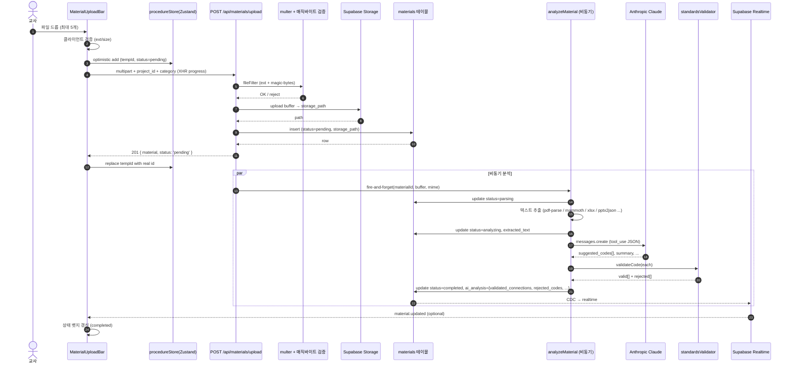
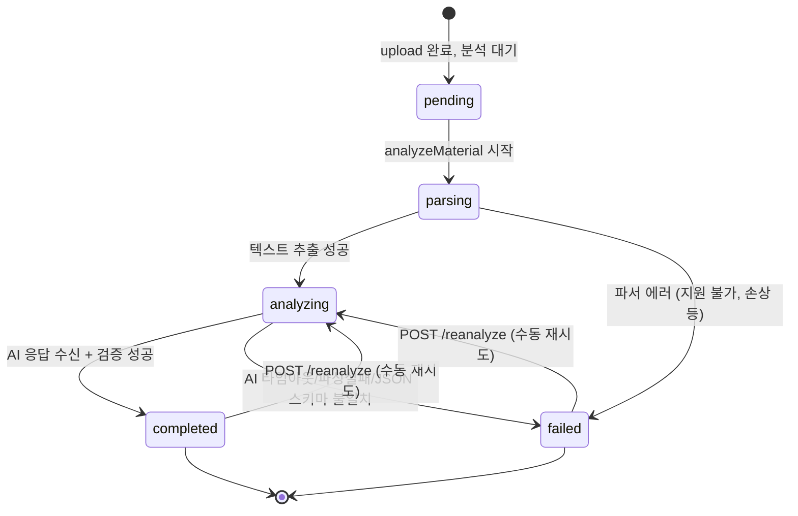

# 파일 업로드 전면 재설계

> **대상**: `curriculum-weaver` 파일 업로드 파이프라인 (서버/클라이언트/AI 분석/스토리지/검증 전 구간)
> **작성일**: 2026-04-18
> **상태**: 설계 제안 (Draft v1)
> **범위**: `server/routes/materials.js`, `server/services/materialAnalyzer.js`, `client/src/components/MaterialUploadBar.jsx`, `client/src/stores/procedureStore.js`, Supabase `materials` 테이블, Supabase Storage
> **비범위**: `aiAgent.js`(채팅 에이전트) 리팩토링, 교육과정 데이터 확장 — 별도 태스크

---

## 0. 요약: 무엇을 바꾸는가

| 구분 | 현재 | 재설계 후 |
|------|------|----------|
| AI 분석 | 플레이스홀더 문자열만 저장 (`analyzeMaterial` 미호출) | 업로드 직후 비동기 파이프라인 호출, DB에 결과 저장 |
| 할루시네이션 방지 | 없음 (AI가 가짜 성취기준 코드 생성 가능) | `standardsValidator.validateCode()`로 필터링, 검증 통과 코드만 노출 |
| 원본 파일 | 인메모리(서버 재시작 시 소실) | Supabase Storage `materials/{project_id}/{uuid}.{ext}` |
| 파서 지원 | pdf/doc/docx/이미지(플레이스홀더) | pdf/docx/txt/csv/pptx/xlsx/hwpx + 이미지(보류), doc 거부 |
| 진행 표시 | 없음, `alert()` 에러 | XHR progress, 드래그&드롭, 다중, 인라인 에러, 상태 뱃지 |
| 키 일관성 | `session_id`/`projectId` 혼재 | `project_id`로 통일 |
| 검증 | MIME 확장자만 | 확장자 + 매직바이트(`file-type`) + 크기 + 경로 sanitize |
| 테스트 | 0건 | 업로드/파싱/검증/할루시네이션 단위·통합 테스트 |

---

## 1. 아키텍처 다이어그램

### 1.1 전체 플로우 (happy path)



### 1.2 동기/비동기 분기 결정

| 단계 | 동기/비동기 | 이유 |
|------|------------|------|
| 파일 수신 + Storage 업로드 + 최초 DB 행 삽입 | **동기** | UI가 파일 ID를 즉시 받아야 낙관적 업데이트 확정 가능 |
| 텍스트 추출 + AI 분석 + 검증 | **비동기 (fire-and-forget)** | 10초~30초 걸릴 수 있음. HTTP 요청 블로킹 금지 |
| 진행 상태 반영 | **폴링 or Realtime** | MVP는 폴링(`GET /api/materials/:id/analysis` 3초 간격), Phase 2에서 Supabase Realtime 채널로 전환 |

> **TODO: 결정 필요** — MVP에서 폴링을 쓸지 Realtime을 바로 쓸지. Supabase Realtime은 이미 세션 단위로 구독 중이므로 `materials` 테이블만 추가 publication에 넣으면 됨. 그쪽을 추천.

### 1.3 상태 전이



- DB 컬럼명: `processing_status` 유지 (기존 스키마 호환). 값: `pending | parsing | analyzing | completed | failed`.
- 현재 스키마는 `processing | completed | failed` 3단계 — 마이그레이션 필요.

---

## 2. API 스키마 (서버-클라이언트 계약)

모든 엔드포인트 prefix: `/api/materials`. 모든 식별자는 `project_id` (camelCase 금지, snake_case 유지).

### 2.1 `POST /api/materials/upload`

**Request** (`multipart/form-data`)

| 필드 | 타입 | 필수 | 설명 |
|------|------|------|------|
| `file` | File | ✅ | 업로드 파일 (최대 20MB) |
| `project_id` | string (uuid) | ✅ | 프로젝트 ID |
| `category` | enum | - | `reference | lesson_plan | student_work | news | school_doc | worksheet | other` (기본 `reference`) |
| `procedure_code` | string | - | 업로드 시점 현재 절차 (예: `A-1-2`) — AI 분석 힌트로 활용 |

**Response 201**
```json
{
  "material": {
    "id": "uuid",
    "project_id": "uuid",
    "file_name": "인공지능과_윤리.pdf",
    "file_type": "pdf",
    "mime_type": "application/pdf",
    "file_size": 892341,
    "category": "reference",
    "storage_path": "materials/{project_id}/{uuid}.pdf",
    "storage_url": "https://.../signed-url (15분 유효)",
    "processing_status": "pending",
    "ai_summary": null,
    "ai_analysis": null,
    "created_at": "2026-04-18T10:00:00Z"
  }
}
```

**Response 4xx 통일 포맷**
```json
{ "error": { "code": "FILE_TOO_LARGE", "message": "파일은 20MB 이하여야 합니다.", "field": "file" } }
```

| HTTP | code | 시나리오 |
|------|------|----------|
| 400 | `FILE_REQUIRED` | file 필드 없음 |
| 400 | `PROJECT_ID_REQUIRED` | project_id 없음 |
| 400 | `FILE_TOO_LARGE` | >20MB |
| 415 | `UNSUPPORTED_TYPE` | 확장자 또는 매직바이트 불일치 |
| 403 | `ACCESS_DENIED` | workspace 멤버 아님 |
| 409 | `DUPLICATE_FILE` | (선택) 동일 hash 이미 존재 |
| 500 | `STORAGE_UPLOAD_FAILED` | Supabase Storage 오류 |

### 2.2 `GET /api/materials?project_id={uuid}`

**Response 200**
```json
{
  "materials": [
    { "id": "...", "project_id": "...", "file_name": "...", "processing_status": "completed", "ai_summary": "...", "created_at": "..." }
  ]
}
```

- 정렬: `created_at DESC`.
- `ai_analysis`는 목록에서 제외(용량 큼). 상세 조회에서만 반환.

### 2.3 `GET /api/materials/:id/analysis`

**Response 200**
```json
{
  "material": { "id": "...", "processing_status": "completed" },
  "analysis": {
    "material_type": "뉴스기사",
    "summary": "AI 윤리 관련 사례 3개를 다룬 기사.",
    "key_insights": ["학생 토론 주제로 활용 가능", "..."],
    "validated_connections": [
      { "code": "[9과05-01]", "content": "...", "confidence": 0.82, "match_reason": "ai" }
    ],
    "rejected_codes": [
      { "code": "[9과99-99]", "reason": "not_found" },
      { "code": "[9과5-01]", "reason": "format_mismatch", "suggestion": "[9과05-01]" }
    ],
    "design_suggestions": ["..."],
    "extracted_keywords": ["인공지능", "윤리", "편향"]
  }
}
```

- `processing_status !== 'completed'`인 경우 `analysis`는 `null` 반환, HTTP 200 유지 (폴링 친화).

### 2.4 `POST /api/materials/:id/reanalyze`

재분석 트리거. body 없음. 서버에서 Storage의 파일을 다시 읽어 파이프라인 재실행.

**Response 202**
```json
{ "material": { "id": "...", "processing_status": "parsing" } }
```

### 2.5 `DELETE /api/materials/:id`

Storage + DB 행 모두 삭제. 워크스페이스 편집 권한 필요.

### 2.6 `GET /api/materials/:id/download`

Storage signed URL(15분) redirect 또는 JSON 반환.

### 2.7 제거

- ❌ `GET /api/materials/:sessionId` — path에 sessionId 두는 방식 제거 → query `project_id=` 사용
- ❌ `GET /api/materials/analysis/:id` — 위 `GET /api/materials/:id/analysis`로 대체

---

## 3. AI 분석 시스템 프롬프트 재설계

### 3.1 현재 프롬프트의 한계

1. `curriculum_connections`에 모델이 "그럴듯한 코드"를 생성 — 검증 없이 그대로 저장
2. 시스템 프롬프트가 없어 프롬프트 캐싱 불가 (토큰 낭비)
3. JSON 스키마 강제가 약함 (정규식으로 추출 → 실패 시 `raw` 덤프)
4. 교과목·학년 힌트가 주입되지 않아 코드 추천이 무작위
5. 재시도 전략 없음

### 3.2 새로운 구조 — 시스템 프롬프트 분리 + tool_use 강제

```js
// 시스템 프롬프트 (캐싱 대상, 1KB 이하)
const SYSTEM_PROMPT = `
당신은 한국 2022 개정 교육과정 기반 융합 수업 설계 보조 AI입니다.
교사가 업로드한 자료를 분석해 수업 설계에 활용 가능한 인사이트를 JSON으로 반환합니다.

규칙:
1. 성취기준 코드는 "후보"로만 제시하세요. 형식은 [9과05-01] 같은 대괄호 포함 표준 형식만 허용됩니다.
2. 확신이 없으면 suggested_standard_codes를 빈 배열로 두세요. 추측으로 채우지 마십시오.
3. summary는 최대 3문장, design_suggestions는 최대 5개.
4. 반드시 provided tool을 호출해 JSON으로만 응답하세요. 자유 텍스트 금지.
`.trim()

// 사용자 메시지 (매 요청마다 변동)
const USER_MESSAGE = `
자료 카테고리: ${category}
업로드 시점 절차: ${procedure_code ?? '미지정'}
프로젝트 대상 학년·교과 힌트: ${grade_hint}, ${subject_hint}

<자료본문 최대 10,000자>
${truncatedText}
</자료본문>
`
```

### 3.3 Tool 스키마 (JSON 출력 강제)

```js
const ANALYZE_TOOL = {
  name: 'submit_material_analysis',
  description: '교사가 업로드한 수업자료에 대한 구조화된 분석 결과를 제출합니다.',
  input_schema: {
    type: 'object',
    required: ['material_type', 'summary', 'key_insights', 'suggested_standard_codes', 'design_suggestions', 'extracted_keywords'],
    properties: {
      material_type: {
        type: 'string',
        enum: ['교과서단원', '수업지도안', '활동지', '뉴스기사', '학교문서', '학생결과물', '연구논문', '기타'],
      },
      summary: { type: 'string', maxLength: 400 },
      key_insights: { type: 'array', items: { type: 'string' }, maxItems: 8 },
      suggested_standard_codes: {
        type: 'array',
        items: {
          type: 'object',
          required: ['code', 'confidence', 'reason'],
          properties: {
            code: { type: 'string', pattern: '^\\[[\\d\\w가-힣 ]+-[\\d]+-[\\d]+\\]$|^\\[[\\d\\w가-힣 ]+[\\d]+-[\\d]+\\]$' },
            confidence: { type: 'number', minimum: 0, maximum: 1 },
            reason: { type: 'string', maxLength: 200 },
          },
        },
        maxItems: 10,
      },
      design_suggestions: { type: 'array', items: { type: 'string' }, maxItems: 5 },
      extracted_keywords: { type: 'array', items: { type: 'string' }, maxItems: 15 },
    },
  },
}
```

### 3.4 Anthropic SDK 호출

```js
const response = await client.messages.create({
  model: 'claude-opus-4-7', // 프로젝트 상위 모델과 일치
  max_tokens: 2048,
  system: [{ type: 'text', text: SYSTEM_PROMPT, cache_control: { type: 'ephemeral' } }],
  tools: [ANALYZE_TOOL],
  tool_choice: { type: 'tool', name: 'submit_material_analysis' },
  messages: [{ role: 'user', content: USER_MESSAGE }],
})

const toolUse = response.content.find(b => b.type === 'tool_use')
const aiRaw = toolUse?.input  // 이미 구조화된 JS 객체
```

- 시스템 프롬프트에 `cache_control` 부착 → 동일 세션 여러 파일 분석 시 캐시 히트
- `tool_choice`로 도구 강제 호출 → JSON 파싱 실패 근본 제거
- 파싱 실패 시 1회 재시도 후 `status=failed`로 전환

### 3.5 토큰 예산

| 구간 | 상한 |
|------|------|
| 자료 본문 | 10,000자(≈ 7,500 tokens) |
| 시스템 프롬프트 | 1,000 tokens (캐싱) |
| 응답 | 2,048 tokens |
| 총 요청 추정 | 약 10,500 tokens/파일 |

---

## 4. 파일 처리 정책

### 4.1 허용·거부 매트릭스

| 확장자 | MIME (매직바이트) | 파서 | 상태 |
|--------|------------------|------|------|
| pdf | `application/pdf` | `pdf-parse` | ✅ 1차 |
| docx | `application/vnd.openxmlformats-officedocument.wordprocessingml.document` | `mammoth` | ✅ 1차 |
| txt | `text/plain` | native UTF-8 | ✅ 1차 |
| csv | `text/csv` | native | ✅ 1차 |
| pptx | `application/vnd.openxmlformats-officedocument.presentationml.presentation` | `node-pptx-parser` or `officeparser` | ✅ 1차 |
| xlsx | `application/vnd.openxmlformats-officedocument.spreadsheetml.sheet` | `xlsx` | ✅ 1차 |
| hwpx | `application/hwp+zip` (매직 `PK..`) | `hwp.js` or `node-hwp` (검토) | ✅ 1차 (best-effort) |
| hwp | `application/x-hwp` (OLE) | 파서 없음 → 플레이스홀더 `[한글 바이너리 — 미지원. hwpx로 변환해주세요]` | ⚠️ 파싱 스킵, 저장만 |
| jpg/png/webp | image/* | 텍스트 추출 보류 | ⚠️ 플레이스홀더 (Phase 2: Vision API) |
| doc | `application/msword` (OLE) | 거부 | ❌ |
| ppt, xls | OLE | 거부 | ❌ |
| 나머지 | - | 거부 | ❌ |

> **TODO: 결정 필요** — hwpx 파서 품질. `hwp.js`는 브라우저용. 서버용 믿을 만한 파서 없으면 1차에서 빼고 "플레이스홀더+저장만"으로 낮출 것.

### 4.2 크기/수량 상한

- 파일당 최대 **20MB** (현재 10MB에서 상향; pdf 교과서 단원 고려)
- 동시 업로드 **최대 5개**
- 프로젝트당 누적 최대 **200MB** (초과 시 `STORAGE_QUOTA_EXCEEDED`)

### 4.3 Storage 경로 & 보안

```
버킷: materials (private)
경로: {project_id}/{uuid}.{ext}
```

- 파일명은 UUID로 **재작성** (원본 파일명은 DB의 `file_name`에만 저장) — path traversal·한글 파일명 인코딩 문제 원천 차단
- 다운로드는 signed URL (15분 TTL)
- RLS: `bucket_id = 'materials' AND path[1] IN (SELECT project_id FROM project_members WHERE user_id = auth.uid())`

### 4.4 매직바이트 검증

```js
import { fileTypeFromBuffer } from 'file-type'

const detected = await fileTypeFromBuffer(file.buffer)
if (!detected || !ALLOWED_MIMES.includes(detected.mime)) {
  throw new UnsupportedTypeError(...)
}
// 확장자와 MIME 일치 여부 크로스체크 (예: .pdf인데 실제는 zip → 거부)
```

- `txt`, `csv`, `hwp`는 `file-type`이 감지 못 할 수 있음 → 화이트리스트 우회(단, 크기 상한 엄수)

---

## 5. 할루시네이션 방지 파이프라인

### 5.1 데이터 흐름

```mermaid
flowchart LR
    A[AI tool_use output<br/>suggested_standard_codes] --> B{validateCode}
    B -->|valid| C[validated_connections]
    B -->|suggestion(edit_distance<=3)| D[auto_corrected]
    D --> C
    B -->|invalid| E[rejected_codes]
    C --> F[(DB materials.ai_analysis)]
    E --> F
```

### 5.2 구현 스펙

```js
// materialAnalyzer.js 내부
function filterHallucinations(suggestedCodes) {
  const validated = []
  const rejected = []

  for (const item of suggestedCodes) {
    const result = validateCode(item.code)

    if (result.valid && result.matched) {
      validated.push({
        code: result.matched.code,
        content: result.matched.content,
        subject: result.matched.subject_group,
        confidence: item.confidence,
        reason: item.reason,
        match_reason: 'exact',
      })
    } else if (result.suggestion && result.distance <= 2) {
      // 편집거리 1~2만 자동 교정 (3은 너무 관대)
      validated.push({
        code: result.suggestion.code,
        content: result.suggestion.content,
        subject: result.suggestion.subject_group,
        confidence: Math.max(0, item.confidence - 0.15), // 교정 → confidence 감쇠
        reason: item.reason,
        match_reason: 'auto_corrected',
        original_code: item.code,
      })
    } else {
      rejected.push({
        code: item.code,
        reason: result.suggestion ? 'too_distant' : 'not_found',
        suggestion: result.suggestion?.code ?? null,
        edit_distance: result.distance ?? null,
        original_reason: item.reason,
      })
    }
  }

  return { validated, rejected }
}
```

### 5.3 검증 정책

- UI에 노출되는 코드는 **validated_connections만**
- `rejected_codes`는 UI에 노출하지 않고 DB에만 저장 (디버깅·프롬프트 개선용)
- confidence < 0.3인 validated도 UI에서는 "낮은 신뢰도" 배지 표기
- 같은 자료에 대한 `rejected_codes` 비율이 >50%이면 telemetry에 기록 (프롬프트 튜닝 지표)

### 5.4 채팅 응답과의 일관성

`standardsValidator.validateCodesInText`는 이미 채팅(`routes/chat.js`)에 적용 중. 본 설계는 **파일 분석도 동일 검증 게이트를 통과**시켜 교사에게 보이는 모든 성취기준 코드가 실제 DB에 존재함을 보장.

---

## 6. 프론트엔드 UX

### 6.1 구성요소 재구조

```
MaterialUploadBar (진입점, 드롭존 전체 래핑)
├── MaterialDropZone         — 드래그 오버 시각화, 다중 파일 수신
├── MaterialCategoryChips    — 카테고리 선택 (기존)
├── MaterialUploadQueue      — 업로드 중 파일들 (progress bar + status badge)
└── MaterialList             — 업로드 완료 자료 목록
    └── MaterialItem         — 상태 뱃지(pending/parsing/analyzing/completed/failed) + 재분석 버튼
```

### 6.2 드래그&드롭

```jsx
<div
  onDragOver={(e) => { e.preventDefault(); setDragOver(true) }}
  onDragLeave={() => setDragOver(false)}
  onDrop={(e) => {
    e.preventDefault()
    setDragOver(false)
    const files = Array.from(e.dataTransfer.files).slice(0, 5)
    files.forEach(f => enqueueUpload(f))
  }}
  className={dragOver ? 'ring-2 ring-blue-500 bg-blue-50' : ''}
>
```

### 6.3 진행률 (XHR)

```js
async function uploadWithProgress(file, projectId, onProgress) {
  return new Promise((resolve, reject) => {
    const xhr = new XMLHttpRequest()
    xhr.open('POST', '/api/materials/upload')
    xhr.upload.onprogress = (e) => {
      if (e.lengthComputable) onProgress(Math.round((e.loaded / e.total) * 100))
    }
    xhr.onload = () => xhr.status < 400
      ? resolve(JSON.parse(xhr.responseText))
      : reject(new Error(safeParseError(xhr.responseText)))
    xhr.onerror = () => reject(new Error('NETWORK_FAILURE'))
    // ... FormData append, setRequestHeader(auth), send
  })
}
```

- 업로드 완료 후 분석 단계는 서버 사이드 → 프론트는 폴링 또는 Realtime으로 상태 수신

### 6.4 낙관적 업데이트 + 롤백

```js
// store.js
async function uploadMaterial(projectId, file, category) {
  const tempId = `temp-${crypto.randomUUID()}`
  const optimistic = { id: tempId, file_name: file.name, file_size: file.size, processing_status: 'uploading', _optimistic: true, progress: 0 }
  set(s => ({ materials: [optimistic, ...s.materials] }))

  try {
    const res = await api.uploadMaterial(projectId, file, category, (progress) => {
      set(s => ({ materials: s.materials.map(m => m.id === tempId ? { ...m, progress } : m) }))
    })
    set(s => ({ materials: s.materials.map(m => m.id === tempId ? res.material : m) }))
    return res.material
  } catch (err) {
    set(s => ({ materials: s.materials.map(m => m.id === tempId ? { ...m, processing_status: 'failed', _error: err.message } : m) }))
    throw err
  }
}
```

- 실패 시 즉시 제거하지 않고 `failed` 뱃지 + 재시도 버튼 제공 (파일 버퍼는 잃어버림 → "다시 선택" 안내)

### 6.5 상태 뱃지

| status | 라벨 | 색상 | 아이콘 |
|--------|------|------|--------|
| uploading | 업로드 중 N% | blue | spinner |
| pending | 분석 대기 | gray | clock |
| parsing | 파싱 중 | amber | Loader2 |
| analyzing | AI 분석 중 | purple | Sparkles |
| completed | 분석 완료 | green | Check |
| failed | 실패 | red | AlertCircle (+ 재분석 버튼) |

### 6.6 인라인 에러 (alert 제거)

- `MaterialUploadBar` 내부에 ephemeral 토스트 영역
- 에러 코드 → 한국어 메시지 매핑 (§9)

### 6.7 Realtime 구독 (Phase 2, 권장)

```js
useEffect(() => {
  const ch = supabase
    .channel(`materials:${projectId}`)
    .on('postgres_changes', { event: 'UPDATE', schema: 'public', table: 'materials', filter: `project_id=eq.${projectId}` },
      (payload) => updateMaterial(payload.new))
    .subscribe()
  return () => supabase.removeChannel(ch)
}, [projectId])
```

---

## 7. 상태관리 (Zustand `procedureStore`)

### 7.1 state 확장

```js
materials: [],             // 기존
uploadQueue: [],           // 업로드 중 파일 (tempId 포함)
uploadErrors: {},          // { [tempId]: { code, message } }
reanalyzingIds: new Set(), // 재분석 중
```

### 7.2 액션 추가

- `uploadMaterial(projectId, file, category)` — XHR progress 콜백 포함, 낙관적 업데이트
- `uploadMultiple(projectId, files, category)` — 병렬 N=3 제한
- `reanalyzeMaterial(id)`
- `deleteMaterial(id)`
- `applyRealtimeMaterial(row)` — Realtime payload 수신 시 배열 갱신
- `dismissUploadError(tempId)`

### 7.3 selector

- `materials: { completed, inProgress, failed }` — 파생 배열

---

## 8. 마이그레이션 전략

### 8.1 DB 스키마 변경

> 스키마 SQL 작성은 **스키마-아키텍트에게 위임**. 아래는 요구사항 명세.

1. `materials` 테이블
   - `session_id (uuid)` 컬럼이 있다면 `project_id (uuid)`로 rename (또는 둘 다 존재 시 `project_id`를 canonical로 하고 `session_id`는 deprecated view)
   - `processing_status` 체크 제약: `pending | parsing | analyzing | completed | failed`
   - `mime_type text` 추가
   - `ai_analysis jsonb` 유지 (단, 스키마는 `{ material_type, summary, key_insights, validated_connections, rejected_codes, design_suggestions, extracted_keywords, meta }`)
   - `content_hash text` 추가 (sha256, 중복 검출용)
   - `storage_path text NOT NULL` 필수화
2. Storage 버킷 `materials` 생성 + private + RLS
3. `curriculum_links` 테이블과는 독립 (교차 참조 없음)

### 8.2 코드 레벨 전환 체크포인트

```
[P0] 인메모리 Materials 제거, supabaseAdmin 경유로 통일   → server/lib/store.js, routes/materials.js
[P0] session_id 레거시 키 → project_id 일원화             → client/api, store, 컴포넌트 prop 전부
[P1] 프론트 prop sessionId → projectId rename            → MaterialUploadBar, 호출부 전수
[P1] Supabase Storage 업로드 래퍼 추가                    → server/lib/storage.js (신규)
[P2] analyzeMaterial fire-and-forget 연결                → routes/materials.js upload 핸들러 말미
[P2] standardsValidator 통합                             → materialAnalyzer.js
[P3] Realtime publication에 materials 추가               → supabase/migrations/XXXXX_materials_realtime.sql
```

### 8.3 데이터 이관

현재 인메모리 `Materials.list()`는 서버 재시작으로 사라지므로 이관할 "진짜 데이터" 없음. 기존 플레이스홀더 자료를 DB에 적재할 필요 없음 — 신규부터 정식 파이프라인 사용.

---

## 9. 에러 분류 · 사용자 메시지 매핑

| 코드 | 상황 | 사용자 메시지 (한국어) | 복구 액션 |
|------|------|----------------------|----------|
| `FILE_REQUIRED` | 파일 누락 | "파일을 선택해주세요." | 파일 선택 유도 |
| `FILE_TOO_LARGE` | >20MB | "파일이 너무 큽니다. 20MB 이하로 올려주세요." | 압축/분할 안내 |
| `UNSUPPORTED_TYPE` | 확장자/매직바이트 불일치 | "지원하지 않는 형식입니다. PDF, DOCX, PPTX, XLSX, TXT, CSV, HWPX를 이용해주세요." | 변환 안내 (특히 doc→docx) |
| `STORAGE_QUOTA_EXCEEDED` | 프로젝트 누적 초과 | "프로젝트 저장 용량을 초과했습니다. 이전 자료를 정리해주세요." | 목록 스크롤, 삭제 |
| `STORAGE_UPLOAD_FAILED` | Supabase Storage 5xx | "업로드 서버에 일시적인 문제가 발생했어요. 다시 시도해주세요." | 재시도 버튼 |
| `NETWORK_FAILURE` | XHR onerror | "네트워크 연결을 확인하고 다시 시도해주세요." | 재시도 |
| `ACCESS_DENIED` | 워크스페이스 멤버 아님 | "이 프로젝트에 접근 권한이 없습니다." | 뒤로가기 |
| `PARSE_FAILED` | 파서 예외 | "파일 내용을 읽지 못했어요. 손상되었거나 보호된 파일일 수 있어요." | 다른 파일 |
| `AI_TIMEOUT` | AI 30초 초과 | "AI 분석이 지연되고 있어요. 잠시 뒤 '재분석'을 눌러주세요." | 재분석 버튼 |
| `AI_SCHEMA_INVALID` | tool_use 출력 스키마 불일치 | "AI 분석 결과가 올바르지 않아요. 재분석을 시도해주세요." | 재분석 |
| `HALLUCINATION_HEAVY` | rejected_codes 비율 > 80% | (UI 알림 없음, telemetry만) | — |
| `DUPLICATE_FILE` | 동일 hash 존재 | "같은 파일이 이미 업로드되어 있어요." | 기존 항목으로 스크롤 |

---

## 10. 구현 작업 분해 (WBS)

### 10.1 백엔드 (`backend-engineer`)

- [ ] `server/lib/storage.js` 신규 — Supabase Storage 업로드/삭제/signed URL 래퍼
- [ ] `server/routes/materials.js` 전면 재작성
  - [ ] `project_id` 기준 일원화, `session_id` 제거
  - [ ] `multer` memoryStorage + 20MB 상한
  - [ ] `file-type`로 매직바이트 검증
  - [ ] Storage 업로드 → DB insert → fire-and-forget `analyzeMaterial` 호출
  - [ ] `GET /api/materials?project_id=`, `GET /:id/analysis`, `POST /:id/reanalyze`, `DELETE /:id`, `GET /:id/download`
  - [ ] 통일 에러 포맷 `{ error: { code, message, field? } }`
- [ ] `server/services/materialAnalyzer.js` 재작성
  - [ ] 시스템 프롬프트 분리 + `cache_control`
  - [ ] `tool_choice`로 JSON 강제
  - [ ] 파서 분기: pdf/docx/txt/csv/xlsx/pptx/hwpx (+ doc 거부, 이미지 보류)
  - [ ] `standardsValidator.validateCode` 파이프 연결
  - [ ] 상태 전이 `pending → parsing → analyzing → completed/failed` 정확히 기록
  - [ ] AI 타임아웃 30초, JSON 재시도 1회
- [ ] `server/lib/standardsValidator.js` — `filterHallucinations` 헬퍼 추가 (또는 analyzer 로컬)
- [ ] 테스트
  - [ ] `materials.test.js`: 업로드 성공/크기초과/MIME오류/권한 없음
  - [ ] `materialAnalyzer.test.js`: PDF→summary, 할루시네이션 필터링, tool_use 재시도
  - [ ] Storage 업로드 mock 테스트

### 10.2 프론트엔드 (`frontend-engineer`)

- [ ] `client/src/components/MaterialUploadBar.jsx` 재작성
  - [ ] prop `sessionId` → `projectId` rename (호출부 전수 수정)
  - [ ] 드래그&드롭 전체 컨테이너
  - [ ] 다중 파일 큐 + 병렬 3
  - [ ] XHR progress
  - [ ] 인라인 에러 토스트 (alert 제거)
- [ ] `client/src/components/MaterialItem.jsx` 분리 — 상태 뱃지, 재분석/삭제 버튼, 다운로드 링크
- [ ] `client/src/stores/procedureStore.js`
  - [ ] `uploadMaterial` XHR + progress 콜백
  - [ ] `uploadMultiple`, `reanalyzeMaterial`, `deleteMaterial`, `applyRealtimeMaterial`
  - [ ] selector `materialsInProgress`, `materialsFailed`
- [ ] `client/src/lib/api.js`
  - [ ] `uploadMaterialXHR(projectId, file, category, onProgress)`
  - [ ] `getMaterials({ projectId })`, `getMaterialAnalysis(id)`, `reanalyze(id)`, `deleteMaterial(id)`
- [ ] Realtime 구독 훅 `useMaterialsRealtime(projectId)` (Phase 2)
- [ ] 에러 코드→한국어 메시지 매핑 `client/src/lib/materialErrors.js`

### 10.3 스키마 (`schema-architect` 위임)

- [ ] `supabase/migrations/00016_materials_redesign.sql`
  - [ ] `session_id` → `project_id` 전환
  - [ ] `processing_status` enum 확장
  - [ ] `mime_type`, `content_hash` 컬럼 추가
  - [ ] `storage_path NOT NULL` 제약
  - [ ] 인덱스: `(project_id, created_at desc)`, `content_hash`
- [ ] `materials` 버킷 생성 + RLS
- [ ] Realtime publication에 `materials` 추가

### 10.4 QA (`qa-validator`)

- [ ] 시나리오 테스트 매트릭스
  - [ ] 정상: pdf/docx/txt/csv/pptx/xlsx/hwpx 각 1개씩
  - [ ] 경계: 19.9MB vs 20.1MB, 빈 파일, 0바이트 pdf
  - [ ] 악성: `.pdf` 확장자인 zip 파일, `.docx` 확장자인 실행파일
  - [ ] 동시 5개 업로드 race condition
  - [ ] AI 타임아웃 시 failed 상태 확인 + 재분석 성공
  - [ ] 할루시네이션: 가짜 코드 생성 시뮬레이션 → validated_connections에 누출되지 않음 검증
  - [ ] 서버 재시작 후 파일 다시 접근 가능
  - [ ] workspace 비멤버 403
- [ ] 성능: 10MB PDF 업로드→completed 90초 이내 (p95)
- [ ] 보안: path traversal 시도 (`../../etc/passwd`) → 차단

---

## 11. 오픈 이슈 & TODO

1. **TODO: 결정 필요** — hwpx 파서 선택. 믿을 만한 서버용 라이브러리가 없으면 1차 미지원.
2. **TODO: 결정 필요** — Realtime vs 폴링. Realtime 권장.
3. **TODO: 결정 필요** — 프로젝트당 자료 상한 200MB가 적절한지. 과학 교과서 PDF 몇 개만 올려도 근접.
4. **TODO: 결정 필요** — doc/ppt/xls (OLE 레거시) 거부가 정책적으로 OK인지. 교사 현장에서 `.doc`을 여전히 쓸 가능성 — "자동 변환 후 업로드" 안내만 제공.
5. **TODO: 결정 필요** — AI 분석 결과에 대한 교사 피드백 UI (좋아요/싫어요)를 바로 넣을지, Phase 2로 미룰지.
6. **TODO: 결정 필요** — 이미지 분석 Vision API (Claude vision) 연동 시점. MVP는 플레이스홀더.

---

## 12. 성공 지표 (런칭 후 4주)

- 업로드 성공률 ≥ 98%
- `failed` 상태 비율 ≤ 5%
- `rejected_codes` / `suggested_standard_codes` 평균 비율 ≤ 15% (할루시네이션 억제)
- p95 분석 완료 시간 ≤ 60s (PDF 10MB 기준)
- 교사가 `validated_connections` 중 실제 수업 설계에 **채택한 비율** 로깅 (제품 품질 지표)
