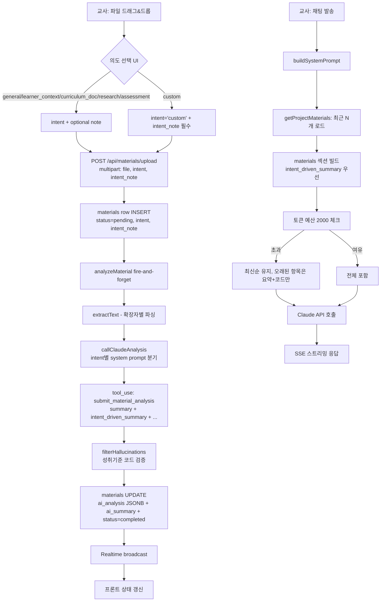

# 자료 컨텍스트 강화 설계 (A+B+D 통합)

**문서 버전**: 1.0  
**작성일**: 2026-04-18  
**대상 파일**: `server/services/materialAnalyzer.js`, `server/services/aiAgent.js`, `server/routes/materials.js`, `client/src/components/MaterialUploadBar.jsx`, `shared/constants.js`, `supabase/migrations/00019_*.sql`

## 0. 핵심 개선 요지

| 영역 | AS-IS | TO-BE |
|------|-------|-------|
| summary 길이 | 3문장 | 5~7문장, 최대 500자, 구조형(개괄+포인트+활용) |
| 채팅 주입 | `ai_summary`만 (80% 미활용) | summary + key_insights(3) + validated_connections + design_suggestions(2) |
| 교사 의도 | 없음 (범용 요약) | 6종 intent + custom note로 요약 톤 전환 |
| 토큰 관리 | 없음 (폭주 위험) | materials 섹션 ~2,000토큰 예산, LRU 컷 |
| 필드 | summary만 단일 | `summary` (범용) + `intent_driven_summary` (의도 맞춤) |

---

## 1. 전체 플로우 (Mermaid)



---

## 2. 스키마 변경

### 2.1 신규 마이그레이션: `supabase/migrations/00019_materials_intent.sql`

```sql
-- ────────────────────────────────────────────────────────────
-- 00019_materials_intent.sql
-- 교사 업로드 의도(intent) 컬럼 추가 + 기존 데이터 backfill
-- 관련 문서: _workspace/design/material-context-enhancement.md §2
-- ────────────────────────────────────────────────────────────

-- 1. intent 컬럼 추가 (6종 고정값 + NULL 허용은 불가 — default general)
ALTER TABLE materials
  ADD COLUMN IF NOT EXISTS intent TEXT NOT NULL DEFAULT 'general',
  ADD COLUMN IF NOT EXISTS intent_note TEXT;  -- custom일 때만 사용

-- 2. CHECK 제약 — 유효한 intent만 허용
ALTER TABLE materials
  DROP CONSTRAINT IF EXISTS materials_intent_check;

ALTER TABLE materials
  ADD CONSTRAINT materials_intent_check
  CHECK (intent IN (
    'general',
    'learner_context',
    'curriculum_doc',
    'research',
    'assessment',
    'custom'
  ));

-- 3. custom일 때 intent_note 필수 (DB 레벨 방어선)
ALTER TABLE materials
  DROP CONSTRAINT IF EXISTS materials_custom_note_required;

ALTER TABLE materials
  ADD CONSTRAINT materials_custom_note_required
  CHECK (
    intent <> 'custom'
    OR (intent_note IS NOT NULL AND length(trim(intent_note)) > 0)
  );

-- 4. 기존 데이터 backfill (DEFAULT로 이미 채워지지만, 명시적 UPDATE로 안전장치)
UPDATE materials
  SET intent = 'general'
  WHERE intent IS NULL;

-- 5. 조회 인덱스 (프로젝트별 intent 필터링용)
CREATE INDEX IF NOT EXISTS materials_project_intent_idx
  ON materials(project_id, intent);

COMMENT ON COLUMN materials.intent IS
  '교사의 업로드 의도 — analyzer 프롬프트 분기 + 채팅 컨텍스트 주입 기준';
COMMENT ON COLUMN materials.intent_note IS
  'custom intent일 때의 자유 메모 (최대 120자 권장, 앱 레벨에서 검증)';
```

### 2.2 `ai_analysis` JSONB 구조 확장

```typescript
// server/services/materialAnalyzer.js 의 analysis 객체 타입
interface MaterialAnalysis {
  material_type: '교과서단원' | '수업지도안' | '활동지' | '뉴스기사'
               | '학교문서' | '학생결과물' | '연구논문' | '기타';

  // [기존] 범용 요약 — 항상 존재
  summary: string;                        // 5~7문장, ≤500자

  // [신규] 의도 맞춤 요약 — intent='general'일 때만 summary와 동일해도 됨
  intent_driven_summary: string;          // ≤500자, intent별 톤 적용

  key_insights: string[];                 // ≤8개
  design_suggestions: string[];           // ≤5개
  extracted_keywords: string[];           // ≤15개

  validated_connections: Array<{
    code: string;
    content: string;
    subject: string;
    confidence: number;
    reason: string;
    match_reason: 'exact' | 'auto_corrected';
    original_code?: string;
    edit_distance?: number;
  }>;

  rejected_codes: Array<{
    code: string;
    reason: 'too_distant' | 'not_found';
    suggestion: string | null;
    edit_distance: number | null;
    original_reason: string;
  }>;

  meta: {
    model: string;
    rejected_ratio: number;
    intent: string;           // [신규] 분석 시점 intent (materials.intent 와 동일 값 스냅샷)
    intent_note?: string;     // [신규]
    prompt_version: '2025-04-a';  // [신규] 프롬프트 버전 관리
  };
}
```

`materials` 테이블의 `ai_summary` 컬럼은 **범용 요약 `summary`만** 저장 (레거시 호환). 채팅 빌더는 `ai_analysis.intent_driven_summary`를 우선 사용하고 없으면 `ai_summary` fallback.

---

## 3. analyzer 프롬프트 재설계

### 3.1 시스템 프롬프트 템플릿

`server/services/materialAnalyzer.js`의 `SYSTEM_PROMPT` 상수를 **함수**로 변경:

```javascript
function buildSystemPrompt({ intent, intentNote }) {
  const intentBlock = INTENT_PROMPT_FRAGMENTS[intent] || INTENT_PROMPT_FRAGMENTS.general;
  const noteLine = intent === 'custom' && intentNote
    ? `교사 메모: "${intentNote.slice(0, 200)}"\n위 메모의 맥락을 최우선으로 요약·인사이트에 반영하세요.`
    : '';

  return `당신은 한국 2022 개정 교육과정 기반 융합 수업 설계 보조 AI입니다.
교사가 업로드한 자료를 분석해 수업 설계에 활용 가능한 인사이트를 구조화된 JSON으로 반환합니다.

[교사 업로드 의도]
${intentBlock}
${noteLine}

[절대 규칙]
1. 성취기준 코드(suggested_standard_codes)는 "후보"로만 제시합니다. 형식은 [9과05-01], [4수02-03]처럼 대괄호 포함 한국 교육과정 표준 형식만 허용됩니다.
2. 확신이 없으면 빈 배열을 반환하세요. 추측으로 코드를 만들지 마세요.
3. summary는 5~7문장, 500자 이내로 작성합니다. 구조는 "개괄(1~2문장) → 핵심 포인트(2~3문장) → 수업 활용 제안(1~2문장)" 순서를 지키세요.
4. intent_driven_summary는 위 [교사 업로드 의도]의 지시에 맞춰 별도로 작성합니다. intent가 'general'이면 summary와 동일해도 됩니다.
5. design_suggestions는 최대 5개, key_insights는 최대 8개, extracted_keywords는 최대 15개입니다.
6. 반드시 제공된 tool(submit_material_analysis)을 호출해 JSON으로만 응답하세요. 자유 텍스트는 금지입니다.`
}

const INTENT_PROMPT_FRAGMENTS = {
  general:
    '교사는 이 자료를 범용 수업 참고자료로 올렸습니다. 균형 잡힌 요약과 다각도 활용 제안을 제공하세요.',

  learner_context:
    '교사는 이 자료를 "학습자/맥락 정보"로 올렸습니다. intent_driven_summary에서 학습자의 학년·수준·선수지식·관심사·특성을 최우선으로 추출하세요. 성취기준 매칭보다 학습자 프로파일이 중요합니다. design_suggestions는 이 학습자 프로파일에 맞춘 차별화 수업 전략으로 작성하세요.',

  curriculum_doc:
    '교사는 이 자료를 "교육과정 문서"(성취기준 해설서, 교과 교육과정 등)로 올렸습니다. intent_driven_summary는 어떤 교과·영역·성취기준을 다루는지 명시적으로 나열하세요. suggested_standard_codes를 가장 적극적으로 추출하되, 문서에 명시된 코드만 사용하고 추측하지 마세요.',

  research:
    '교사는 이 자료를 "선행 연구/이론"으로 올렸습니다. intent_driven_summary에서 핵심 개념, 이론적 틀, 주요 발견, 교육적 함의를 순서대로 정리하세요. key_insights는 수업 설계에 영감을 줄 만한 이론적 관점이어야 합니다.',

  assessment:
    '교사는 이 자료를 "평가 문항/활동지"로 올렸습니다. intent_driven_summary에서 문제 유형(선택형/서술형/수행형 등), 난이도, 측정하는 핵심 역량, 공통 오답 패턴이 있다면 그것을 우선 추출하세요. design_suggestions는 이 문항들을 변형·확장·대체할 아이디어로 작성하세요.',

  custom:
    '교사가 직접 메모로 의도를 지정했습니다. 아래 교사 메모를 최우선 지침으로 삼아 intent_driven_summary와 key_insights를 작성하세요.',
}
```

### 3.2 Tool input_schema 확장

```javascript
const ANALYZE_TOOL = {
  name: 'submit_material_analysis',
  description: '교사가 업로드한 수업자료에 대한 구조화된 분석 결과를 제출합니다.',
  input_schema: {
    type: 'object',
    required: [
      'material_type',
      'summary',
      'intent_driven_summary',   // ← 신규 필수
      'key_insights',
      'suggested_standard_codes',
      'design_suggestions',
      'extracted_keywords',
    ],
    properties: {
      material_type: {
        type: 'string',
        enum: ['교과서단원','수업지도안','활동지','뉴스기사','학교문서','학생결과물','연구논문','기타'],
      },
      summary: {
        type: 'string',
        maxLength: 500,
        description: '범용 요약. 5~7문장, 500자 이내, "개괄→포인트→활용" 구조.',
      },
      intent_driven_summary: {
        type: 'string',
        maxLength: 500,
        description: '교사 업로드 의도(intent)에 맞춘 요약. 500자 이내.',
      },
      key_insights: { type: 'array', items: { type: 'string' }, maxItems: 8 },
      suggested_standard_codes: {
        type: 'array', maxItems: 10,
        items: {
          type: 'object',
          required: ['code','confidence','reason'],
          properties: {
            code: { type: 'string' },
            confidence: { type: 'number', minimum: 0, maximum: 1 },
            reason: { type: 'string', maxLength: 200 },
          },
        },
      },
      design_suggestions: { type: 'array', items: { type: 'string' }, maxItems: 5 },
      extracted_keywords: { type: 'array', items: { type: 'string' }, maxItems: 15 },
    },
  },
}
```

### 3.3 callClaudeAnalysis 시그니처 변경

```javascript
async function callClaudeAnalysis(text, { intent, intentNote }) {
  const systemText = buildSystemPrompt({ intent, intentNote })
  // ... 기존과 동일, system 블록만 systemText로 교체
  // 캐싱은 intent별로 프롬프트가 달라지므로, cache_control은 남겨두되
  // 캐시 히트는 같은 intent 업로드가 연속될 때만 발생 — 수용 가능
}
```

---

## 4. `aiAgent.buildSystemPrompt` 개선

### 4.1 materials 섹션 포맷

현재 `server/services/aiAgent.js:469-478`을 다음으로 교체:

```javascript
// ─── 15. 업로드 자료 (intent 기반 풍부 컨텍스트) ───
if (materials && materials.length > 0) {
  const matSection = buildMaterialsContext(materials, {
    budgetTokens: 2000,  // 대략 글자수 = 토큰수로 근사
    maxRichItems: 5,     // 상위 5개만 풍부 포맷, 나머지는 축약
  })
  if (matSection) {
    parts.push(matSection)
  }
}
```

### 4.2 빌더 함수 (신규)

```javascript
const INTENT_LABELS = {
  general: '수업 참고자료',
  learner_context: '학습자/맥락 정보',
  curriculum_doc: '교육과정 문서',
  research: '선행 연구·이론',
  assessment: '평가·활동지',
  custom: '사용자 지정',
}

/**
 * 업로드 자료를 시스템 프롬프트 섹션으로 변환.
 * 토큰 예산 초과 시 최신순 유지, 오래된 자료는 요약+코드만 남긴다.
 *
 * @param {Array<Material>} materials - created_at DESC로 정렬된 자료
 * @param {{budgetTokens: number, maxRichItems: number}} opts
 * @returns {string | null}
 */
function buildMaterialsContext(materials, opts) {
  const { budgetTokens, maxRichItems } = opts
  // 완료된 분석만 사용
  const ready = materials
    .filter((m) => m.ai_summary || m.ai_analysis?.summary)
    .slice(0, 20) // 하드 상한: 20개 이상이면 무조건 자른다

  if (ready.length === 0) return null

  const lines = [`[업로드된 자료 ${ready.length}개]`]
  let used = lines[0].length

  for (let i = 0; i < ready.length; i++) {
    const m = ready[i]
    const rich = i < maxRichItems
    const block = formatMaterialBlock(m, { rich, index: i + 1 })

    // 예산 초과 시 중단하고 "외 N개 생략" 추가
    if (used + block.length > budgetTokens) {
      const remaining = ready.length - i
      if (remaining > 0) {
        lines.push(`\n… 외 ${remaining}개 자료는 컨텍스트 예산으로 생략되었습니다.`)
      }
      break
    }
    lines.push(block)
    used += block.length
  }

  return lines.join('\n')
}

function formatMaterialBlock(m, { rich, index }) {
  const ax = m.ai_analysis || {}
  const intent = m.intent || 'general'
  const intentLabel = INTENT_LABELS[intent] || '수업 참고자료'
  const intentNote = intent === 'custom' && m.intent_note ? ` — "${m.intent_note}"` : ''
  const materialType = ax.material_type || '기타'

  // 의도 맞춤 요약 우선, 없으면 범용 요약, 둘 다 없으면 ai_summary
  const summary = ax.intent_driven_summary || ax.summary || m.ai_summary || ''

  if (!rich) {
    // 축약 포맷: 이름 + intent + summary + 연결 코드
    const codes = (ax.validated_connections || [])
      .slice(0, 3)
      .map((c) => c.code)
      .join(', ')
    return `${index}. ${m.file_name} (${intentLabel})
   요약: ${summary.slice(0, 200)}
   ${codes ? `연결 성취기준: ${codes}` : ''}`
  }

  // 풍부 포맷
  const insights = (ax.key_insights || []).slice(0, 3)
  const connections = (ax.validated_connections || []).slice(0, 5)
  const suggestions = (ax.design_suggestions || []).slice(0, 2)

  const out = [`${index}. ${m.file_name} (${materialType}, 의도: ${intentLabel}${intentNote})`]
  if (summary) out.push(`   요약: ${summary}`)
  if (insights.length) {
    out.push(`   핵심 인사이트:`)
    for (const it of insights) out.push(`     - ${it}`)
  }
  if (connections.length) {
    const codeLine = connections.map((c) => c.code).join(', ')
    out.push(`   관련 성취기준: ${codeLine}`)
  }
  if (suggestions.length) {
    out.push(`   수업 활용 제안:`)
    for (const s of suggestions) out.push(`     - ${s}`)
  }
  return out.join('\n')
}
```

### 4.3 토큰 예산 알고리즘 (pseudo)

```
INPUT: materials[] (created_at DESC), budgetTokens=2000, maxRichItems=5
1. ready ← filter(ai_summary 존재) 후 slice(0, 20)
2. used ← 헤더 길이
3. for i in 0..ready.length:
     rich ← (i < maxRichItems)
     block ← formatMaterialBlock(ready[i], rich)
     if used + block.length > budgetTokens:
       append "외 N개 생략"
       break
     append block
     used += block.length
4. return joined text
```

한국어는 대략 **1글자 ≈ 1.2~1.5 BPE 토큰**이지만, 보수적으로 **1:1 근사**로 계산해 실제 토큰은 예산보다 약간 많음 → 안전 마진을 내장하는 효과.

### 4.4 여러 intent 자료 동시 처리 규칙

- **learner_context**: `maxRichItems` 슬롯에서도 최상단에 고정 배치 (학습자 정보는 늘 최우선). 구현: `ready`를 `intent==='learner_context'`인 항목부터 정렬.
- **curriculum_doc**: `validated_connections`가 많을수록 가치 큼 → 연결 코드를 5개까지 허용 (다른 intent는 3개).
- **assessment**: `design_suggestions`를 최대 3개로 늘려서 포함 (평가 문항 변형 아이디어가 핵심).
- **custom**: `intent_note`를 반드시 프롬프트에 포함하여 AI가 의도를 알 수 있게 함.

정렬 규칙(의사코드):

```
sortKey(m) = [
  m.intent === 'learner_context' ? 0 : 1,  // 학습자 맥락 최우선
  -new Date(m.created_at).getTime()        // 그 다음 최신순
]
```

---

## 5. 프론트엔드 UX

### 5.1 비교: "모달 방식" vs "파일 행별 드롭다운 방식"

| 기준 | A. 모달 방식 | B. 파일 행별 드롭다운 |
|------|------------|---------------------|
| 단일 파일 업로드 | 자연스러움 | 과다 절차 |
| 다중 파일 (서로 다른 intent) | 파일마다 모달 반복 → 피곤 | 한 화면에서 일괄 지정 |
| 발견성 | 높음 (강제 노출) | 중간 (아이콘만 보이면 놓칠 수 있음) |
| 구현 비용 | 낮음 | 중간 (Pending 테이블 필요) |
| 실수 방지 | 높음 (모달 없이는 업로드 진행 불가) | 중간 (기본값 'general'로 빠져나갈 위험) |

**추천: B안 (파일 행별 드롭다운) + "일괄 적용" 버튼**. 단일 파일 시엔 드래그&드롭 즉시 Pending 행이 나타나고 intent 드롭다운이 강조 상태로 표시. 5초간 기본값 `general`로 확정되지 않으면 업로드 버튼이 흐려져 의도 선택을 유도.

### 5.2 UI 와이어프레임 (텍스트 다이어그램)

```
┌─ MaterialUploadBar ────────────────────────────────────────────────┐
│                                                                    │
│  [+ 파일 드래그&드롭 or 클릭]                                       │
│                                                                    │
│ ── 업로드 대기 (2) ─────────────────  [모두 general 적용] [업로드] │
│                                                                    │
│  📄 ecology-lesson-plan.pdf                                       │
│     의도: [ 📑 교육과정 문서 ▼ ]   메모: (비활성)           [×]    │
│                                                                    │
│  📄 class-3-1-profile.docx                                        │
│     의도: [ 📋 학습자/맥락 정보 ▼ ]  메모: (비활성)         [×]    │
│                                                                    │
│  📄 custom-memo.md                                                │
│     의도: [ ✍️ 사용자 지정 ▼ ]                                     │
│     메모: [학급 토론 활동지 - 갈등 상황 분석...] (필수) 12/120자    │
│                                                                    │
└────────────────────────────────────────────────────────────────────┘

드롭다운 펼친 상태:
┌─────────────────────────────────────────┐
│ 📘 수업 참고자료 (범용)         ← 기본   │
│ 📋 학습자/맥락 정보                      │
│ 📑 교육과정 문서 (성취기준 우선)         │
│ 🔬 선행 연구·이론 (핵심 개념)            │
│ ✏️ 평가·활동지 (문제 유형·수준)          │
│ ─────────────────────────────────────── │
│ ✍️ 사용자 지정 (직접 입력)               │
└─────────────────────────────────────────┘
```

### 5.3 프론트 상태/스토어 변경

`client/src/stores/materialsStore.js` (또는 동등):

```javascript
pendingUploads: [
  {
    tempId: string,
    file: File,
    intent: 'general',           // 기본값
    intentNote: '',
    isValid: boolean,            // custom일 때 intentNote 길이 > 0
  }
]

// 액션
setPendingIntent(tempId, intent)
setPendingIntentNote(tempId, note)
applyIntentToAll(intent)
submitPending()  // 각 항목마다 POST /api/materials/upload
```

`MaterialUploadBar.jsx` 추가 요소:
- `<IntentSelect>` 컴포넌트: shared/constants의 `MATERIAL_INTENTS` 순회 렌더
- `intent === 'custom'`일 때만 `<textarea maxLength=120>` 노출
- 업로드 버튼 disabled 조건: `pendingUploads.some(p => !p.isValid)`

---

## 6. API 변경점

### 6.1 `POST /api/materials/upload`

**요청 (multipart/form-data)**:
```
file:         File (기존)
project_id:   string (기존)
intent:       string  ← 신규. 미전달 시 'general'
intent_note:  string  ← 신규. intent='custom'일 때만 필수, 최대 120자
```

**서버 검증 (`server/routes/materials.js`)**:
```javascript
const intent = (req.body.intent || 'general').trim()
const intentNote = (req.body.intent_note || '').trim().slice(0, 120) || null

const validIntents = ['general','learner_context','curriculum_doc','research','assessment','custom']
if (!validIntents.includes(intent)) {
  return res.status(400).json({ error: { code: 'INVALID_INTENT' } })
}
if (intent === 'custom' && !intentNote) {
  return res.status(400).json({ error: { code: 'INTENT_NOTE_REQUIRED' } })
}

// INSERT 시
const { data } = await supabaseAdmin
  .from('materials')
  .insert({ ..., intent, intent_note: intentNote })

// analyzer 호출 시 인자 전달
analyzeMaterial(materialId, buffer, ext, { intent, intentNote })
  .catch(err => console.error(err))
```

### 6.2 `GET /api/materials?project_id=...`

응답 JSON에 다음 필드 포함 (이미 SELECT `*`이면 자동):
```json
{
  "materials": [
    {
      "id": "...",
      "file_name": "...",
      "intent": "learner_context",
      "intent_note": null,
      "ai_summary": "...",
      "ai_analysis": { /* 확장된 JSONB */ },
      "processing_status": "completed"
    }
  ]
}
```

### 6.3 `GET /api/materials/:id/analysis`

응답에 `intent_driven_summary` 별도 노출 (프론트 상세 뷰용):
```json
{
  "material": { "id": "...", "intent": "...", "intent_note": "..." },
  "analysis": {
    "summary": "범용 요약",
    "intent_driven_summary": "의도 맞춤 요약",
    "key_insights": [...],
    "validated_connections": [...],
    "design_suggestions": [...]
  }
}
```

---

## 7. 상수 추가 (`shared/constants.js`)

```javascript
/**
 * 자료 업로드 의도 (6종) — analyzer 프롬프트 분기 + 채팅 컨텍스트 주입 기준
 * @type {Record<string, {id: string, label: string, icon: string, description: string, requireNote: boolean, order: number}>}
 */
export const MATERIAL_INTENTS = {
  general: {
    id: 'general',
    label: '수업 참고자료',
    icon: '📘',
    description: '범용 수업 참고자료 (특별한 지시 없음)',
    requireNote: false,
    order: 0,
  },
  learner_context: {
    id: 'learner_context',
    label: '학습자/맥락 정보',
    icon: '📋',
    description: '학년, 학급 구성, 학습자 특성 정보',
    requireNote: false,
    order: 1,
  },
  curriculum_doc: {
    id: 'curriculum_doc',
    label: '교육과정 문서',
    icon: '📑',
    description: '성취기준 해설서, 교과 교육과정 (성취기준 매칭 우선)',
    requireNote: false,
    order: 2,
  },
  research: {
    id: 'research',
    label: '선행 연구·이론',
    icon: '🔬',
    description: '논문, 이론서 (핵심 개념·이론틀 우선)',
    requireNote: false,
    order: 3,
  },
  assessment: {
    id: 'assessment',
    label: '평가·활동지',
    icon: '✏️',
    description: '시험 문항, 활동지 (문제 유형·수준 우선)',
    requireNote: false,
    order: 4,
  },
  custom: {
    id: 'custom',
    label: '사용자 지정',
    icon: '✍️',
    description: '자유 메모로 의도 직접 입력',
    requireNote: true,
    order: 5,
  },
}

export const MATERIAL_INTENT_LIST = Object.values(MATERIAL_INTENTS)
  .sort((a, b) => a.order - b.order)

export const DEFAULT_MATERIAL_INTENT = 'general'
export const MAX_INTENT_NOTE_LENGTH = 120

// 에러 코드에 추가
// MATERIAL_ERROR_CODES.INVALID_INTENT = 'INVALID_INTENT'
// MATERIAL_ERROR_CODES.INTENT_NOTE_REQUIRED = 'INTENT_NOTE_REQUIRED'
```

---

## 8. WBS (역할별 태스크 분해)

### 8.1 schema-architect
- [ ] `supabase/migrations/00019_materials_intent.sql` 작성 (§2.1 스펙 그대로)
- [ ] 로컬 마이그레이션 적용 및 backfill 검증
- [ ] `ai_analysis` JSONB 구조 타입 문서화 (`server/types/material.d.ts` 또는 JSDoc)
- [ ] 예상 산출물: 1개 SQL 파일, 타입 정의

### 8.2 backend-engineer
- [ ] `server/services/materialAnalyzer.js`
  - [ ] `SYSTEM_PROMPT` 상수 → `buildSystemPrompt({intent, intentNote})` 함수로
  - [ ] `INTENT_PROMPT_FRAGMENTS` 맵 추가 (§3.1)
  - [ ] `ANALYZE_TOOL.input_schema`에 `intent_driven_summary` 추가 (§3.2)
  - [ ] `callClaudeAnalysis(text, {intent, intentNote})` 시그니처 변경
  - [ ] `analyzeMaterial(id, buf, ext, {intent, intentNote})` 시그니처 변경
  - [ ] `ai_analysis.meta`에 `intent`, `intent_note`, `prompt_version` 추가
- [ ] `server/services/aiAgent.js`
  - [ ] `INTENT_LABELS` 상수 import
  - [ ] `buildMaterialsContext(materials, opts)` 함수 추가 (§4.2)
  - [ ] `formatMaterialBlock(m, {rich, index})` 함수 추가
  - [ ] §15 blocks를 새 빌더 호출로 교체
- [ ] `server/routes/materials.js`
  - [ ] POST /upload에 `intent`, `intent_note` 파싱 + 검증
  - [ ] analyzer 호출 시 intent 인자 전달
  - [ ] GET /:id/analysis 응답에 `intent_driven_summary` 포함
- [ ] `server/lib/store.js` 인메모리 Materials에도 `intent`, `intent_note` 필드 반영

### 8.3 frontend-engineer
- [ ] `client/src/components/MaterialUploadBar.jsx`
  - [ ] pending 테이블 UI 추가 (§5.2 와이어프레임)
  - [ ] `<IntentSelect>` 컴포넌트 신규 (shared/constants 기반)
  - [ ] custom intent 선택 시 메모 textarea 조건부 렌더
  - [ ] "모두 general 적용" 일괄 버튼
  - [ ] 업로드 버튼 disabled 로직 (custom + 빈 메모 차단)
- [ ] `client/src/stores/materialsStore.js` (또는 해당 파일)
  - [ ] `pendingUploads` 상태 + 액션 4종 추가 (§5.3)
  - [ ] `POST /api/materials/upload`에 intent/intent_note 전송
- [ ] 자료 상세 패널 (있다면): `intent_driven_summary` 표시 + intent 배지

### 8.4 qa-validator (신규 테스트 케이스)
1. **intent별 분기 검증**: 같은 파일을 intent 5종으로 업로드 → `intent_driven_summary`가 실제로 서로 달라지는지 스냅샷 비교
2. **custom intent_note 강제**: intent='custom' + 빈 note → 400 INTENT_NOTE_REQUIRED 반환
3. **채팅 컨텍스트 주입**: 자료 3개 업로드 후 `/api/sessions/:id/chat` 호출 시 시스템 프롬프트에 intent 라벨과 key_insights가 포함되는지 로깅 검증
4. **토큰 예산 컷**: 20개 자료 업로드 후 `buildMaterialsContext`가 2000자 내외로 잘리고 "외 N개 생략" 텍스트가 붙는지 검증
5. **레거시 호환**: 마이그레이션 전에 업로드된 자료(intent=NULL → 'general' backfill)가 채팅에서 정상 노출되는지 검증

---

## 9. 엣지 케이스

### 9.1 intent='custom'인데 intent_note 공란
- **방어선 1 (프론트)**: 업로드 버튼 disabled + 빨간 헬프 텍스트
- **방어선 2 (서버)**: `400 INTENT_NOTE_REQUIRED`
- **방어선 3 (DB)**: `materials_custom_note_required` CHECK 제약

### 9.2 `intent_driven_summary` 생성 실패
- AI 응답에 해당 필드가 없거나 빈 문자열이면:
  ```javascript
  const idsFallback = aiRaw.intent_driven_summary?.trim() || aiRaw.summary || ''
  analysis.intent_driven_summary = idsFallback
  ```
- 채팅 빌더는 `intent_driven_summary || summary || ai_summary`의 3단 fallback 유지

### 9.3 자료 10개 초과 → 컨텍스트 잘림
- §4.3 알고리즘대로 최신순 + learner_context 우선 유지 후 "외 N개 생략" 고지
- 프론트에도 경고 배너: "최근 업로드 5개만 AI 컨텍스트에 포함됩니다"
- 향후 개선: intent별 필수 포함 슬롯 할당 (curriculum_doc 1개 강제 등)

### 9.4 레거시 자료 (intent 없음)
- 마이그레이션이 DEFAULT 'general'로 backfill → 항상 `intent` 필드 존재
- 단, 이전에 `ai_analysis`에 `intent_driven_summary`가 없음 → fallback 체인으로 summary 사용
- 재분석 버튼 클릭 시 현재 intent로 재생성

### 9.5 intent 값이 migration 이후 추가된 신규 값
- 예: `lesson_plan` 같은 새 intent 추가 시 — 구버전 서버는 CHECK 위반으로 INSERT 실패
- **정책**: intent 목록 변경은 마이그레이션 + 서버 배포를 원자적으로 묶고, 프론트는 상수 기반이므로 빌드 시점에 동기화

### 9.6 동일 프로젝트에 같은 파일을 다른 intent로 재업로드
- 정책: 별개 row로 저장 (중복 허용). 파일명 해시로 dedup하지 않음
- 채팅 컨텍스트에는 둘 다 노출 — intent가 다르면 다른 관점으로 분석되므로 의도된 동작

### 9.7 intent_note에 PII·기밀 포함 위험
- 현재는 클라이언트 경고로 대응: custom 선택 시 "학생 실명·개인정보는 포함하지 마세요" 헬프 텍스트
- 향후 서버 측 PII 마스킹은 TODO

---

## 10. 남은 결정사항 TODO

| # | 항목 | 제안 | 결정 필요 |
|---|------|------|----------|
| 1 | 토큰 예산 기본값 2000 | materials 섹션이 전체 시스템 프롬프트의 몇 %인지 실측 후 조정 | 실측 데이터 수집 필요 |
| 2 | `maxRichItems=5` 적정성 | 자료 평균 업로드 수 데이터 없음 | 초기 출시 후 1주 로그 수집 후 결정 |
| 3 | `MAX_INTENT_NOTE_LENGTH=120` | 프롬프트 내 인용 길이 제한과 연동 | 120/200/500 중 초기 UX 테스트 |
| 4 | learner_context 자료의 특수 처리 깊이 | 현재는 "정렬 최우선"만 적용. 별도 섹션으로 분리해 `[학습자 맥락 자료]` 블록을 만들지? | PM 의견 필요 |
| 5 | intent 변경 시 재분석 자동 트리거 여부 | 현재 설계: 수동 재분석 버튼만. 자동 트리거 시 비용 증가 | 프로덕트 정책 결정 |
| 6 | `prompt_version` 관리 전략 | '2025-04-a'로 시작. 프롬프트 변경 시 버전업 + 기존 자료 재분석 유도 배너? | 운영 정책 결정 |
| 7 | custom intent에 예시 프리셋 제공 | 드롭다운에 "자주 쓰는 메모 5개" 추가할지 | 사용자 테스트 후 |
| 8 | 캐시 히트율 측정 | intent별로 system 프롬프트가 달라져 캐시 효율 저하 가능. intent 분기를 system이 아닌 user 블록으로 옮기는 실험 필요 | A/B 테스트 검토 |
| 9 | `intent_driven_summary` 실패 시 재시도 전략 | 현재: 무재시도 fallback. 실패율이 >5%면 1회 재시도 추가 | 로깅 후 결정 |
| 10 | 파일 업로드 시 intent 자동 추론 | 파일명·확장자·내용 앞 100자로 intent 자동 제안 (교사 확정) | V2 기능으로 분리 |

---

## 부록 A. 마이그레이션 번호 확인

현재 migrations 디렉터리 최대값: `00018_users_rls_tighten.sql`  
→ 신규 파일: **`00019_materials_intent.sql`** (본 문서 §2.1)

## 부록 B. 관련 파일 체크리스트

수정:
- `server/services/materialAnalyzer.js`
- `server/services/aiAgent.js` (15번 블록)
- `server/routes/materials.js` (POST /upload, GET /:id/analysis)
- `server/lib/store.js` (Materials 인메모리 스키마)
- `client/src/components/MaterialUploadBar.jsx`
- `client/src/stores/materialsStore.js` (또는 해당)
- `shared/constants.js` (MATERIAL_INTENTS, 에러 코드 추가)

신규:
- `supabase/migrations/00019_materials_intent.sql`
- `client/src/components/IntentSelect.jsx` (선택 — 분리 권장)

문서:
- `curriculum-weaver/CLAUDE.md`에 §"자료 intent 시스템" 섹션 추가 권장
